# Nova Arcade HD

High-resolution remakes of the [Nova Arcade](https://github.com/drhammadkhan/nova-arcade) games for the Mac desktop and the browser.

The original Nova Arcade runs on a 320×240 ESP32 screen. This fork rebuilds the games at 1920×1080 with:

- vector art, rendered sharp for Retina screens;
- smooth animation;
- a synthesised soundtrack.

All thirteen games are here, each remade with the original's rules and its own art style.

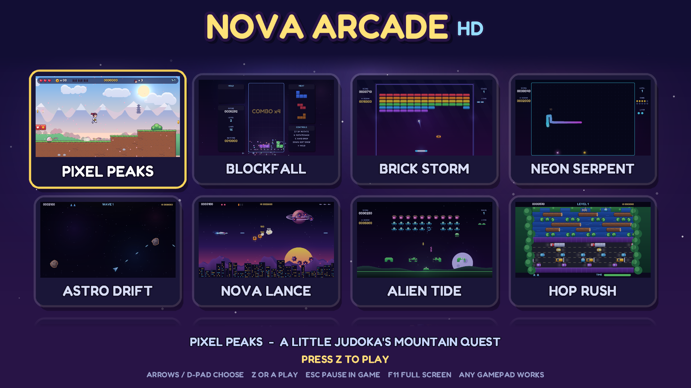

| | | |
|---|---|---|
| 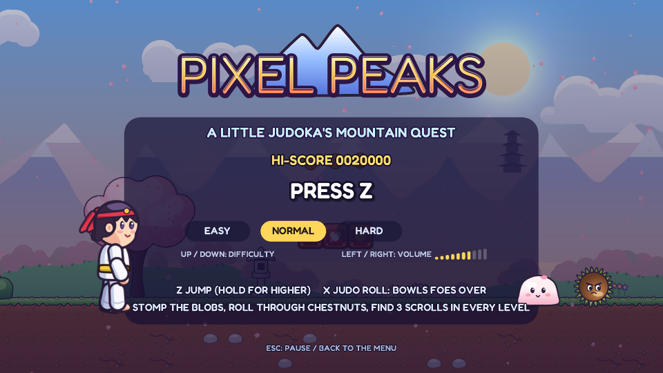 **Pixel Peaks**: a little judoka's mountain platformer | 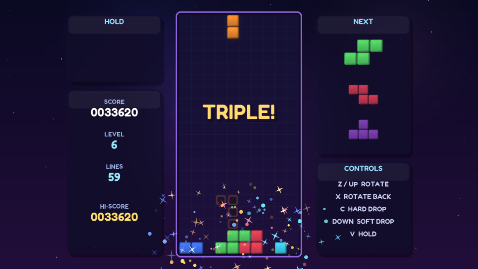 **Blockfall**: falling blocks, with hold, ghost piece and combos | 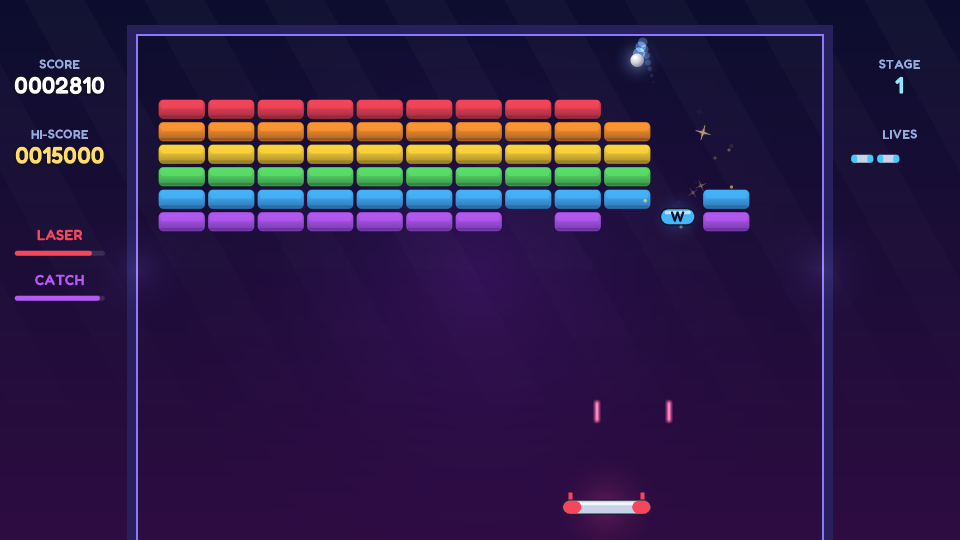 **Brick Storm**: smash every brick, with power-ups |
| 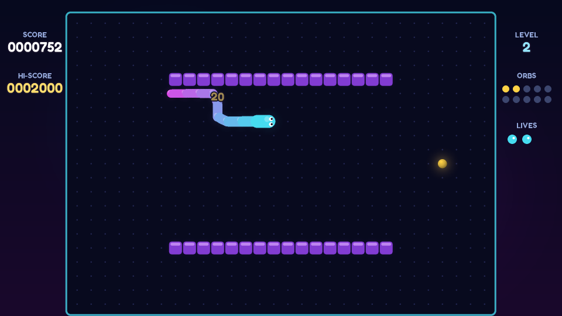 **Neon Serpent**: eat, grow, don't bite yourself | 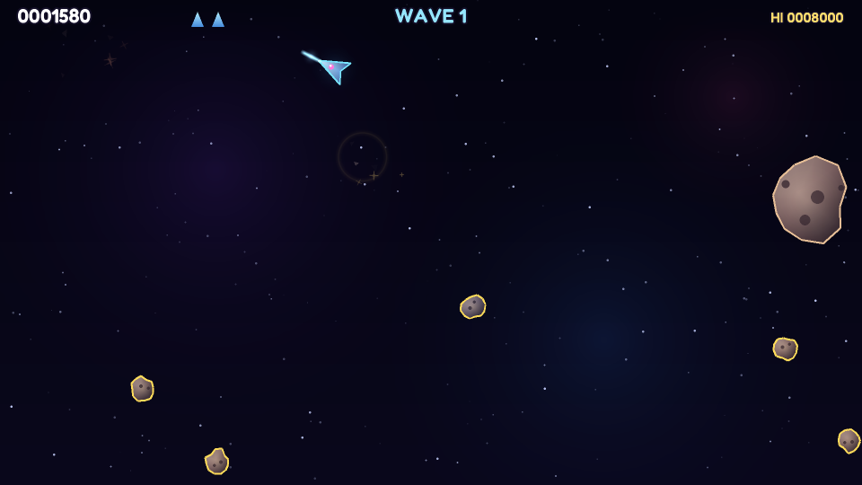 **Astro Drift**: split the rocks, dodge the hunters | 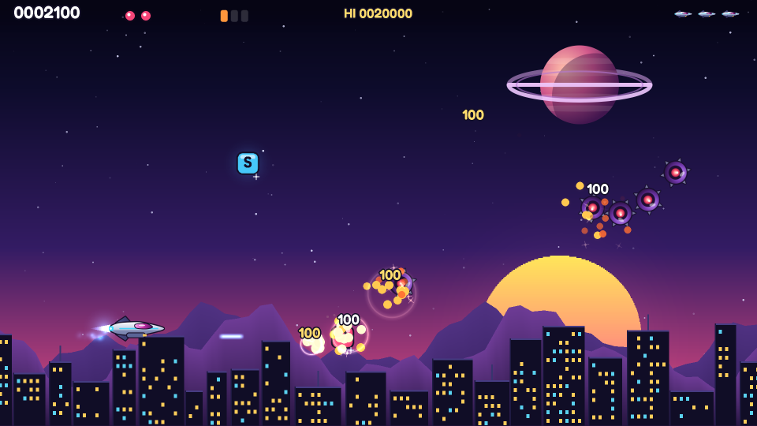 **Nova Lance**: a synthwave shoot-'em-up with a boss |
| 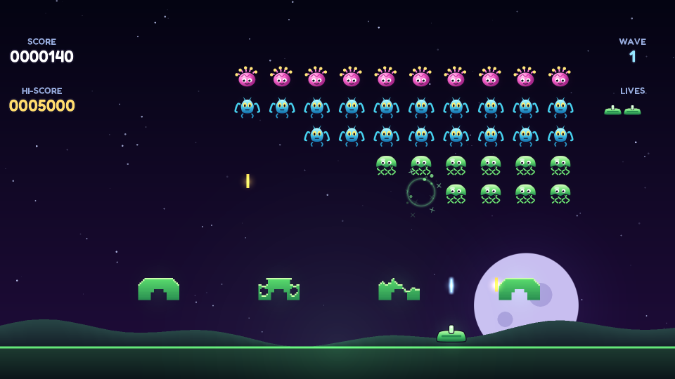 **Alien Tide**: hold back the descending waves | 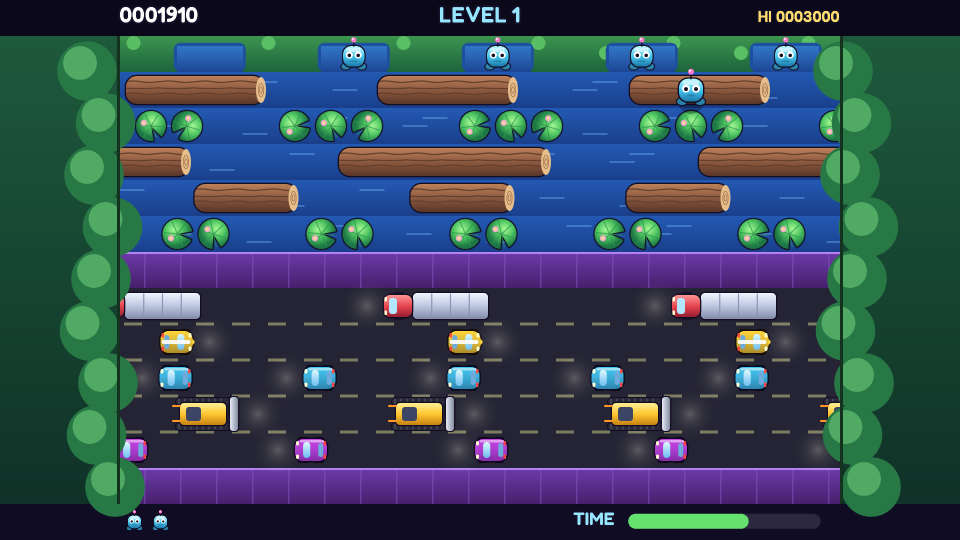 **Hop Rush**: cross the road, ride the river | 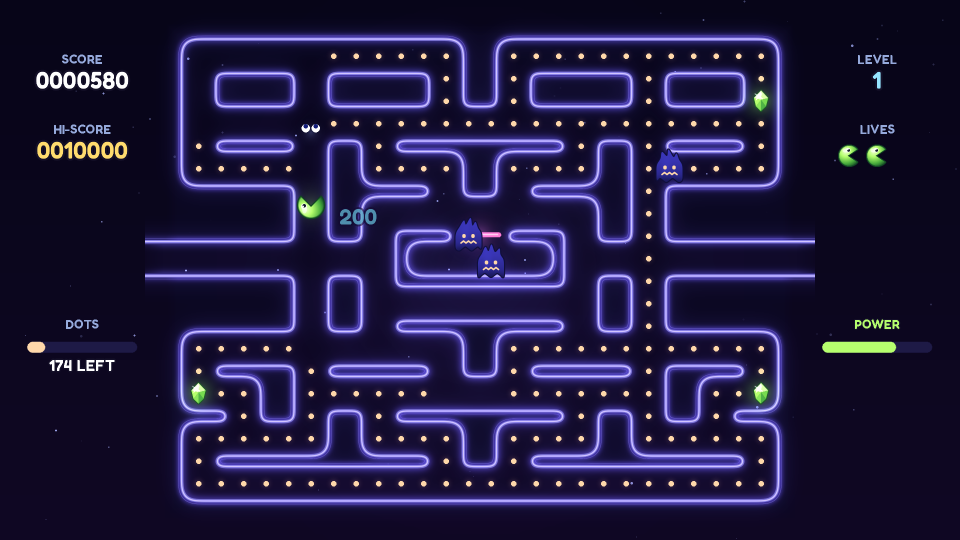 **Maze Munch**: clear the neon maze, outrun the wisps |
| 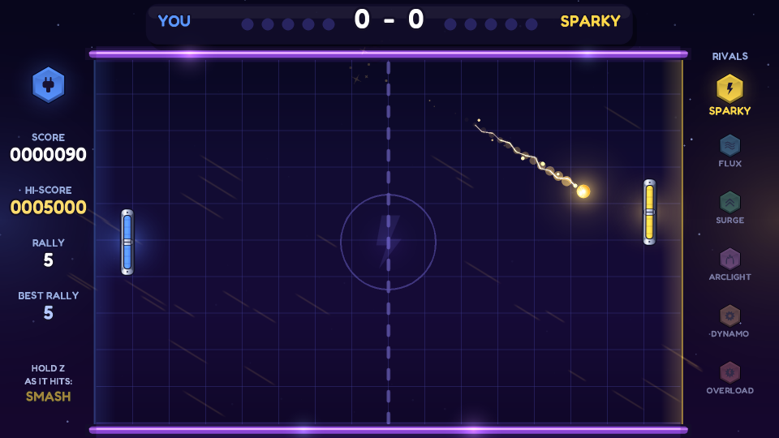 **Volt Rally**: paddle tennis against a ladder of six rivals | 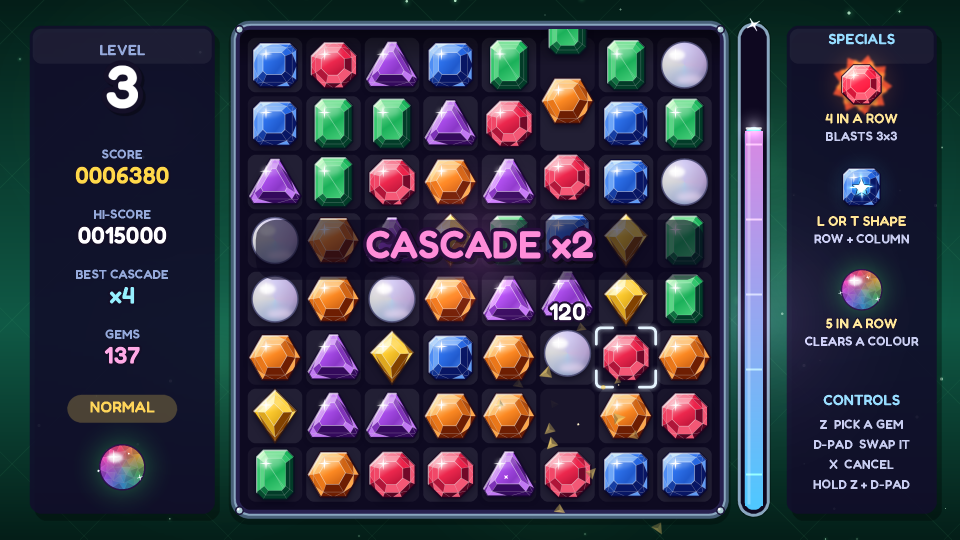 **Gem Cascade**: match three, chain the cascades | 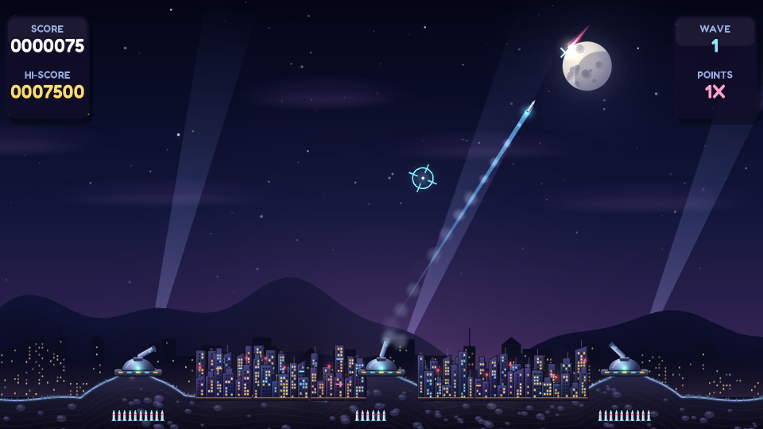 **City Shield**: defend the six cities from the warheads |
| 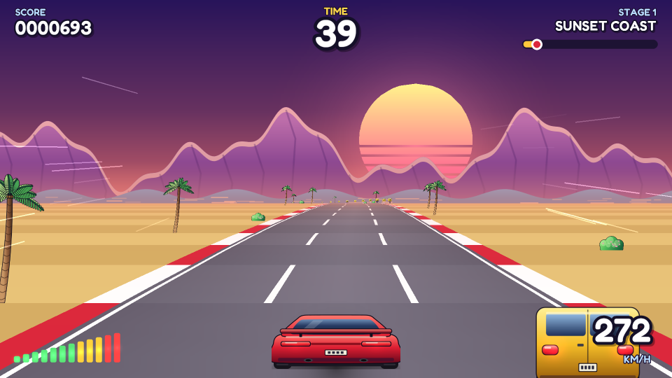 **Turbo Horizon**: a pseudo-3D race against the clock | | |

Every game has three difficulties (Easy, Normal and Hard) with a hi-score for each, and its own soundtrack built from the original's melodies.

## Pixel Peaks HD

A little judoka runs, jumps and rolls over three worlds of mountain trails, with two levels in each world:

- Blossom Hills and Petal River;
- Bamboo Grove and Firefly Marsh;
- Misty Peaks and Summit Shrine.

How to play:

- Stomp the mochi blobs.
- Roll through the spiky chestnuts.
- Find the three secret scrolls in every level.
- Bow at the torii gate to finish.

Her belt changes colour with every level she clears.

What's new compared with the original:

- **Art:**
  - Everything is redrawn as vector art.
  - The heroine is a posed rig of parts, so she runs, jumps, bows and tumbles smoothly. Her ponytail, headband and belt swing as she moves.
  - The backgrounds have painted parallax layers, with weather and lighting for each world: falling petals, dusk fireflies and snow.
- **Levels:**
  - There are six levels instead of three, laid out for a widescreen view.
  - The original three were reworked, and three are new.
- **Sound:**
  - There is a new 48 kHz stereo synth with Karplus-Strong koto, bamboo flute, FM bells, marimba, pads, strings and taiko drums.
  - Reverb and echo are built in.
  - Every tune and sound effect is original.
- **Rules:** the gameplay keeps the original's rules and feel. The physics are the same, scaled up 4.5× to 72-pixel tiles.

## Controls

| | Keyboard | Gamepad |
|---|---|---|
| Move | Arrows / WASD | D-pad or left stick |
| A: OK, jump, fire | Z / Space | A (bottom button) |
| B: back, roll, second action | X / Shift | B (right button) |
| X: third action (Blockfall hard drop, City Shield left base) | C | X (left button) |
| Y (Blockfall hold) | V | Y (top button) |
| Pause | Enter | Start / Menu |
| Pause, back to the games list | Esc | Home / Guide |
| Full screen | F11, Alt+Enter or Ctrl+Cmd+F | |

Each game's title screen shows its own controls, with the button names for whichever you used last (keyboard or pad). On the title screen, Up/Down changes the difficulty and Left/Right changes the volume.

macOS supports Xbox, PlayStation, Switch Pro and 8BitDo pads, as well as most other controllers.

## Building

### Mac app

You need Xcode's command line tools (`xcode-select --install`) and CMake (`brew install cmake`). Then run:

```bash
bash scripts/build-mac.sh
open "build-mac/Nova Arcade HD.app"
```

The script:

- downloads and builds SDL3 the first time;
- makes a universal app for Apple Silicon and Intel;
- zips it as `build/Nova-Arcade-HD-mac.zip`.

The app is ad-hoc signed, not notarised. A copy you built yourself opens normally.

A zip downloaded from the CI artifacts or a release will be blocked by Gatekeeper the first time. To open it either way:

- right-click the app and choose **Open**; or
- run `xattr -dr com.apple.quarantine "Nova Arcade HD.app"`.

### Browser

You need [Emscripten](https://emscripten.org) (`em++` on your `PATH`). Then run:

```bash
bash scripts/build-web.sh
python3 -m http.server -d build/site      # then open http://localhost:8000
```

CI deploys `build/site` to GitHub Pages from `main`.

### Linux and the tests

```bash
cmake -S . -B build && cmake --build build -j
./build/nova                              # the app
./build/test_pixelpeaks bot               # a bot plays all six levels
./build/test_pixelpeaks shots out/        # headless screenshots
./build/test_games smoke                  # every other game's bot plays it for 3 minutes
./build/test_games shots out/ [id]        # title and play screenshots of each game
./build/render_music out/                 # every song and sound effect as WAV files
```

## How it fits together

```
engine/        the Nova HD engine: fixed 1920x1080 frame, 60 Hz logic, SDL3
  nova.h         the API games use: drawing, text, input, saves, difficulty, hi-scores
  gfx.cpp        sprites, shapes, gradients, glows and text on SDL_Renderer (Metal / WebGL)
  audio.cpp      the synth, the song sequencer and the sound effects
  system.cpp     the launcher, the pause menu, settings
  ui.h           shared title screen, game over, banners and HUD panels
  common_art.h   shared sprites (blocks, orbs, sparks, rings) and every game's logo, generated
  platform.cpp   the window, keyboard and gamepads (Mac, Linux, browser)
  headless.cpp   the test runner: software rendering, no window or sound
games/
  games.cpp      the list of games in the launcher
  PixelPeaks/    game.cpp, art.h and levels.h (both generated), tools/
  <Game>/        game.cpp, plus art.h and tools/make_art.py for games with their own sprites
tests/           test_pixelpeaks.cpp and test_games.cpp (headless bots and screenshots)
tools/art/hd.py  vector drawing helpers, the atlas packer and the header writer
tools/art/common_art.py   the shared sprites and logos
tools/port_music.py       turns an original game's tunes into the HD song format
tools/font/      Fredoka (SIL Open Font License) and the font baker
assets/          generated textures, packed into the app and the web build
```

Art and levels are generated by Python scripts (`pip install skia-python numpy pillow`):

- `games/<Game>/tools/make_art.py`: add `--preview DIR` for a contact sheet.
- `tools/art/common_art.py`: the shared sprites and the game logos.
- `games/PixelPeaks/tools/make_levels.py`: this checks that every coin, scroll and box can be reached.
- `tools/font/make_font.py`
- `tools/art/app_icon.py`

## Licence

The code and art are under the MIT licence; see `LICENSE`. The Fredoka font is under the SIL Open Font License; see `tools/font/Fredoka-OFL.txt`.
